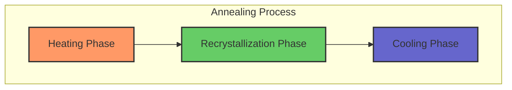

merupakan proses heat treatment di mana metal ter-expose pada temperatur tinggi dengan waktu lama dan slow cooling
# AA
## Tujuan
- melepas stress dari cold rolling
- meningkatkan kelunakan, ductility, dan ketangguhan 
- membuat mikrostruktur 

## Recovery

## Recrystalization

