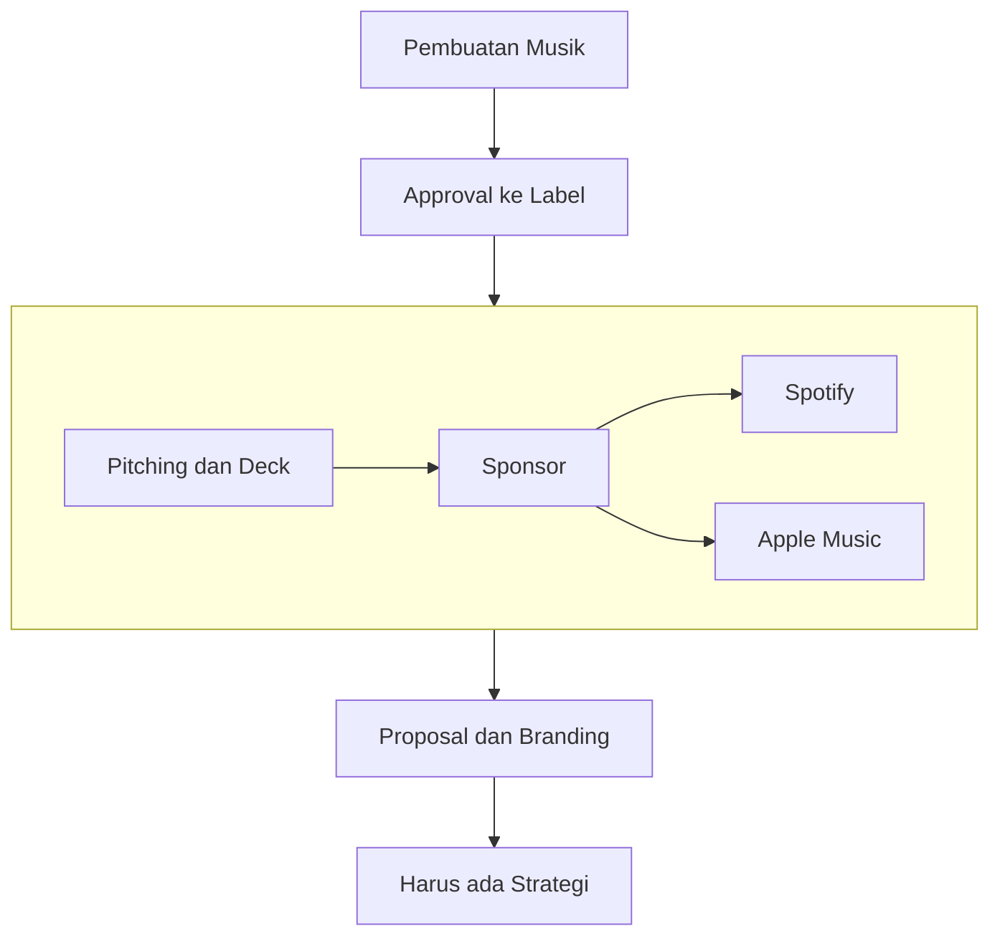
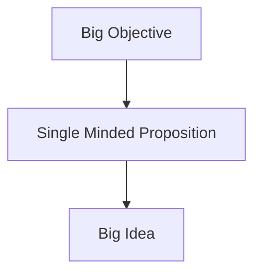
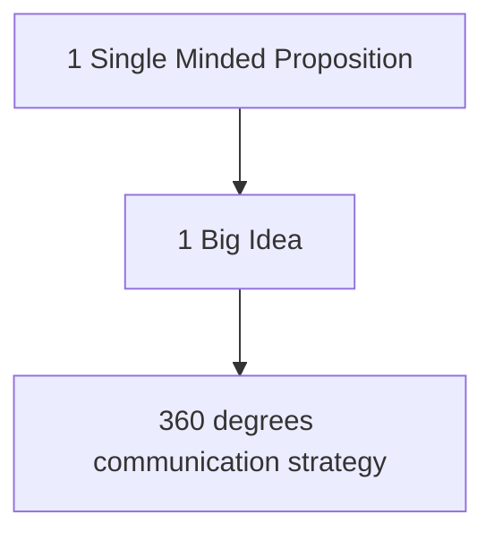

| Date                     | Tags                       |
| ------------------------ | -------------------------- |
| Tuesday, 22 October 2024 | #Semester-5/Eksternal/TPPP |

# Pendahuluan
Mas Awan (Fadli Fikriawan Wibowo) sekarang bekerja di band. Disana beliau bukan hanya membuat musik tetapi juga *bekerja dalam bagian marketing*. Dimana, ketika band tersebut ingin melakukan sesuatu, maka harus ada approval dalam bentuk *pitching dan deck* terlebih dahulu ke label. Tujuan pitching dan deck ini adalah untuk *mendapatkan sponsor*, misalnya dari apple music ataupun dari spotify. Pada pitching dan deck, harus ada proposal dan branding yang diberikan dengan menggunakan berbagai strategi.

---
# How To Make A Winning Pitch Deck
## 1. Presenter dan Isi Proposal
Presenter harus bisa ngejelasin isi proposal (verbal) dan proposal itu harus bisa ngejelasin apa yang dimaksud oleh si penulis. Jadi sebenarnya presentasi itu cuman ngebantu nyampaiin ke klien doang, jadi proposal yang kita kirim misalnya lewat email itu harus bisa ngejelasin ke klien tentang solusi yang kita bawakan. Dan waktu kita presentasi, sebaiknya kita menggunakan itu POWER point, jadi cuman buat beberapa hal yang perlu dibawakan dummy atau mockup saja untuk ngebantu jelasin.
## 2. Contoh Pitching Deck
**A. Sequis**
Sequis ini merupakan sebuah perusahaan asuransi yang memiliki sebuah *permasalahan berupa brand awareness*. Untuk itu, dibuatlah sebuah iklan dengan ide utama yaitu "*hidup selalu ada kejutan*". Di mana ketika orang bahagia (misalnya dapat anak) itu kadang kalau dapat lagi itu belum tentu bahagia (karena ngurusin anak susah). Maka agar dia tetap bisa bahagia ketika dapat anak, hadirlah si sequis ini untuk mengasuransiin keluarganya.

**B. Sariwangi**
Jadi disini sariwangi sebenarnya udah bagus, tapi dia mau nambahin *awareness mengenai isu perbedaan* karena disini Indonesia itu kan ada banyak suku dan sering terjadi perpecahan akibat perbedaan itu. Jadi disini sariwangi hadir untuk *menghangatkan pembicaraan ketika terjadi suatu permasalahan*. Dengan adanya pembicaraan tersebut, maka permasalahan dapat diselesaikan. Ini contohnya adalah misal ada dua orang mau nikah, sedangkan disitu tradisi keluarganya berbeda. Jadi dengan adanya pihak antara kedua keluarga saling berbicara, jadinya mereka sepakatin apa aja boleh, yang penting kedua orang yang nikah ini senang.
## 3. Apakah Klien tau masalah mereka?
Identifikasi terlebih dahulu klien tuh biasanya ada survei atau tidak. Kalau misal mereka ada survei, biasanya mereka tau *masalah apa yang mereka hadapin*. Ini biasanya untuk klien yang udah besar, tapi kalau misal skala UMKM biasanya gak ada survei. Jadi kalau misal mereka belum ada survei, kita harus kasih tau problem yang mereka hadapin itu apa sih. Setelahnya, baru kita *analisis lebih dalam*, kita cari data misalnya tentang tren secara global, tren secara ekonomi yang mikro dan makro atau lain sebagainya. 

## 4. Highlight Problem
Ketika sudah didapatkan problemnya, kita harus *highlight problemnya* dalam *satu kalimat kesimpulan*. Jadi ini nanti sebagai pembuka untuk solusi kita. Ini untuk ngebantu si klien buat lebih ngerti mengenai problem yang mereka hadapin, jadi gak perlu dibuat problem statementnya dalam satu paragraf yang kompleks.

## 5. Insights
Jadi insights atau data pendukung itu gak perlu dijabarin semua, cukup kita tunjukin yang nanti bakalan sesuai dan mendukung tentang solusi kita. Solusi ini yang kita sebut dengan *single minded proposition*. Kalau misal kita jabarin semua insightsnya, nanti klien kita bakalan bingung, apakah solusi yang kita tawarkan ini bisa nyelesaiin semua masalah yang ada? Jadi kita harus *milih-milih lagi insights mana yang sesuai dengan solusi* kita tersebut

## 6. Urutan Presentasi
Jadi urutan dalam presentasi itu dapat dilihat pada diagram berikut:

- *Big Objective*: Mau ngebuat Band Vis penggemarnya gak cuman Jamet
- *Single Minded Proposition*: Lagunya diganti biar gak sosial politik doang
- *Big Idea*: Membuat sebuah album yang menjelaskan mengenai band Visi

**Single Minded Propositon**
Ini digunakan untuk menjelaskan kepada konsumen kenapa mereka sebenarnya membutuhkan sebuah produk. Intinya dari singleminded proposition adalah untuk **mendekatkan ke konsumen secara emosional**. Contoh:
- *MacBook*: sering diiklankan kalau mac ini digunakan oleh orang yang kreatif. Oleh karena itu, banyak orang yang kalau mau ngebuat sesuatu yang 'kreatif' itu nanti belinya pasit macbook.
- *Nike*: ini mereka jelasin kalau nike ini untuk ngebantu orang menang, jadi ketika orang yang berjuang untuk memenangkan sesuatu maka mereka beli produk dari Nike biar merasa ada motivasi. Terutama dengan slogan mereka yang berjudul "Just Do It"

## 7. Lifehack
Menggunakan pertanyaan "... adalah produk/brand yang membuat audience menjadi..."

**Contoh Masmin**:
- *Single minded proposition*: es teh masmin ini untuk orang keren.
- *Big Idea*: Masmin adalah produk/brand yang membuat audience menjadi orang cultured
	- Dari *cultured* tersebut kita buat misalnya sebuah konser yang disponsorin masmin "Masmin Stage"

Notes: Intinya jangan scattered!

Untuk 360 degrees communication strategy isinya mengenai:
- PR
- Brand
- Social Media

**Contoh di NIKE**:
- Keadaan: mereka itu tidak membuat sebuah iklan tentang marathon selama Q4 (Musim Fall, sering marathon), tetapi mereka membuat sebuah iklan mengenai tentang emotional contact buat marathon tersebut, agar lebih terhubung dengan penonton.
- *Big Objective*: Orang menjadi teringat tentang brand NIKE selama Q4 tanpa harus ada iklan tentang marathon tersebut
- *Single Minded Oposition*: Nike membantu orang menang.
- *Big Idea*: Untuk menang itu gak comfortable, pasti harus ada perjuangan. Contoh setelah marathon itu nanti ada capek, atau selama kita training marathon misal cuacanya tidak mendukung. Jadi dengan adanya ini, itu bakalan ada Emotional Contact dengan pembeli

## 8. Pitch Deck
- Untuk pitch deck, kita harus *menggunakan kata-kata yang simple*. Jangan gunakan kata-kata yang kompleks, karena bisa aja klien kita tidak mengerti tentang kata yang kita gunakan, karena itu bisa membuat klien kita malah jadi bingung. Kalau bisa gunakan bahasa sehari-hari, agar mereka itu tetap mengerti.

- Kalau misalnya kita menggunakan kata-kata yang kompleks tersebut, bisa aja klien kita jadi kayak "oh oke oke" agar mereka berpikir "*kata yang digunakan ini kedengarannya keren nih*". Tapi balik lagi, yang paling utama adalah agar si klien itu nanti juga mengerti tentang pitch deck yang kita bawakan, mulai dari problem hingga solusi yang kita bawakan. Agar nanti mereka tidak bingung dengan apa yang kita lakukan nantinya.

## 9. Presentasi
- Selama presentasi, kita harus tau juga mengenai waktu presentasinya, misal kalau udah siang, berarti kan orang cenderung ngantuk dan attention spannya rendah, jadi waktu presentasi harus dibuat singkat misalnya 30~40 menit. Kemudian sisa waktunya digunakan untuk QnA dengan klien.

# Reference
- Fadli Fikriawan Wibowo, Teknik Penulisan Proposal dan Presentasi, 22 Oktober 2024.

