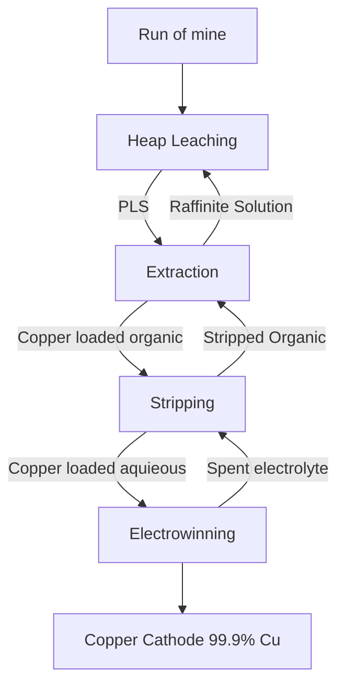

1. Bahan baku minerla (komposisi, jenis material, dll) yang digunakan dalam proses yang digunakan.
2. Jelaskan proses dan kondisinya (diagram alir, kondisi operasi, produk, dll)

# Copper Hydrometallurgy

- Heap leaching: ekstrak tembaga dari bijih nya
- Solvent extraction: untuk mengekstrak tembaga saja
- Electrowinning: tembaga diplating menjadi tembaga kanoda

## Mineral Types
- **Oxide Ores**
	- leach rate fast
	- antlerite, azurite, brochantite, malachite, atacamite, tenorite, cuprite, native copper
	- recovery tinggi (~90%)
	- menghasilkan warna biru ketika di-leaching
- **Secondary Sulphides**
	- leach rate moderate to fast
	- chalcocite, covellite
	- recovery lumayan tinggi (~60-80%)
- **Primary Sulphides**
	- leach rate slow
	- bornite, tetrahedrite, enargite, chalcophyrite
	- recovery rendah (~20%)

## Analisis
- XRD: Untuk mengetahui batuan memiliki mineral apa saja, dapat digunakan XRD, sebuah semi quantitative analysis untuk sampel batuan.
- SEM: terdapat warna yang kontras yang dibaca
- QEMSCAN: Analisis kuantitatif yang dapat mengidentifikasi mineral dengan automatis.