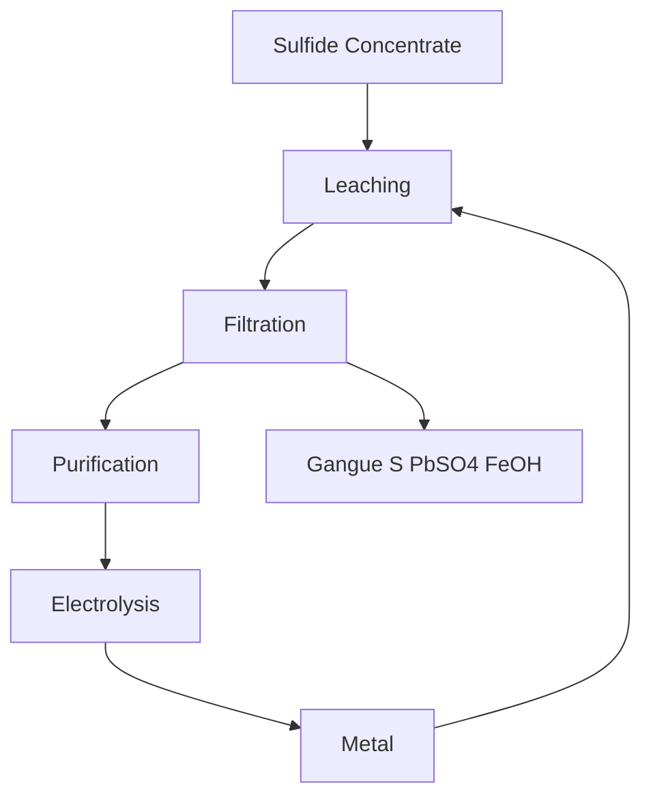

| Date                      | Tags               |
| ------------------------- | ------------------ |
| Wednesday, 28 August 2024 | #Semester-5/Meteks |

# Pembahasan BRP
Sub CMPK (pertanyaan UTS)
- Karakteristik proses metalurgi ekstraksi piro, hidro, dan elektrometalurgi
- Keterkaitan termodinamika material dan kinetika pada proses metalurgi ekstraksi non ferrous
- Prinsip neraca material dalam proses ekstraksi
- Tahapan metode ekstraksi padaa logam non ferrous yang berasa dari sumber primer dan sekunder beserta reaksi dan peralatan prosesnya

## Pressure Leaching

# Sustainable Metals for Circular Economy
We have to reduce the consumption of energy and the emission of greenhouse gases. We have indirect sustainabiliyy measure with materials, such as materials that reduce weight of a car, turbine blades that allow more efficient machine, and catalists. CO2 come from the primary synthesis, suchs as scrap recycling, ore, scarcity of rare earch (lithium and copper) that is energy consuming to mine and produce.
## What have to be done
- Circular and Sustainable production
- CO2 reduction
- Green energy replaces fossile
- Electrification of transport and industry
- Digitalisation and artificial intelligence
- H and H- carriers become important in sustainability.

## Materials Science for Circular Economy
- Artificial intelligence for digital materials and efficient Manufacturing
- Materials for electrification
- Materials as sustainability enablers
- Materials longevity from hydrogen embrittlement
- Design of materials for infinite recycling (1/3 of all materials must be produced from the minerals, so even on the best of all cases there's only 2/3 that is subjected to circular economy)
- Sustainable use of resources in the material value chain

## Efficiency of Transport Cycle
![[Pasted image 20240904055139.png|300]]
Carbon and energy intensity have become better, but the population and gross domestic product per capita gives the market growth. Another growth factor of these markets are the green technologies:
- Wind Turbine: uses alot of concrete, steel, copper -> making sustainable energy are in them self are very rich consumption in materials
- Solar Panel
- Electrification

50% and more of the worlds steel production are used in construction. With the increase of GDP, construction will still go on. The worst case scenario on global warming goes on, we will encounter increasing tides.

## 5-fold acceleration in material consumption
- Population
- GDP/Capita
- Green energy
- Infrastructure
- Coast Protection
Most of these factors can be effected by materials. The consumption of raw material will double in 2060. 

## The indirect effect of sustainability
![[Pasted image 20240904055703.png|300]]
Many of the materials needed are actually quite rare
![[Pasted image 20240904055908.png|300]]
Some of these important and strategic materials have actually end of life recycling rates, some of the elements we need urgently for sustainable energies are not recylable. The punch line is, how do we tame 2 billion tons of metals/year.

Metal production stands for 8% of global energy/yr and uses 2.5 billion tons ore/yr. This production stands for 33% green house gas emission. 

Sustainability needs quantification, here is a simple life cycle assesment
![[Pasted image 20240904060129.png|300]]
We have to calculate the inbound and outbound on each of these part to get the most efficient out of it. The quantification must go through all the product life cycle, but it makes it hard, because some of the production chain have a very carbon dioxide footprint, it is hard for company to agree on joint measures.

Pressure from the customer industries
- Mechanical information for manufacturing process
- Functional properties such as corrosion, longetivity
- Information of sustainability (recycling rate, GHG footprint)

Aluminium Can Carbon Footprint
- Cans are easy to recycle, but most of it is not recyled, so more than half of the material is made from the mineral.

Unintended consequences
- Sustainable energy sources like windmill turbines or solar cells help us making industry more sustainable does not mean that the machine are sustainable. 
- In the future, we must take more care in the circularity of the green energy machine themself.

Deep Sea Mining
- because of scarcity of cobalt, mangan, and copper -> deep sea mining is done -> environmental consenquenses -> can be dangerous for the next generation

Urban Mining
- 1 kg of gold from 200 tons of ore or same amount from 3-4 tons of mobile phones (cpu). Similar arguments in the automotive catalyst.
- We throw away 50 billion euros of electrical waste every year without subjecting it to recycling, and most of that ends as landfill. There will be 18 billion mobile devices in the year 2024, and 75% of those are not collected, and if collected only less than 20% are recycled.
- recycling of electronic waste are for getting the copper and gold.
	![[Pasted image 20240904061040.png|300]]

Enormous quantities that rare being scrapped in metal production
- Many parts are chipped out of the full block rather being made from sheet forming
- Sustainable ->using smart materials such as nano materials that uses more additives and less substractive manufacturing

Sustainability
- Direct -> metallurgical processes such as hydrogen as reductant
- Indirect -> metal products (magnets for electrification)

If eiffel tower built today, it will use 75% less steel with the same design. Another example is chasis on car that contains aluminum, iron, magnesium only have the weight of 270kg
- Step 1: weight reduction (indirect sustainability)
- Step 2: CO2 and Energy reduction (direct sustainability)

Factors of loss material
- Corrosion (5 ton of steel is lost every second)

Market of teel is growing
In 2016, the steel demand are 1600 Mtonnes and will grow to 2800 Mtonnes in 2050. Iron and steel making makes 8% of global CO2 emissions

Thermodynamic
- 6.1 MJ/kg in iron Oxide
- Measured energy to make iron is 18-25 MJ/kg, i.e. conversion efficiency 22-33%
- Solution:
	- reducing the iron ores with hydrogen instead of carbon carrier
		![[Pasted image 20240904071933.png|300]]

![[Pasted image 20240904072053.png|300]]
![[Pasted image 20240904072206.png|300]]
Hematite -> Magnetite -> Roostite
- When roostite is changing into iron, the reaction is sluggish because a film of iron is formed on the oxide
- Further oxygen transport must go through the iron layer
	![[Pasted image 20240904072334.png|300]]
	When seeing the microstructure, there are a couple of things that formed, for example crack delamination in ferrite and wustite. Different oxide and metal state occupy different volume that makes massive porous structure.
	![[Pasted image 20240904072455.png|300]]
	Surface is iron and the center is roostite.

![[Pasted image 20240904073338.png|300]]

Alternative of Process iron
Product -> electric arc furnace while exposing it to small partial pressure of hydrogen.
Flood the reaction chamber with argon and ignite the plasma in the material for one minute and test them. Put them into the oven, flood with same gas and plasma. After 30 minute, reduced pure iron from the ore, the efficiency of consumption in hydrogen is very good. If go through direct reduction, must put the iron sponge.

Metals can be burned to make fuel and recycle
![[Pasted image 20240904073752.png|200]]
The idea is to use powders of metal, combust in a chamber, get the energy, and subject these powder to reduction process and induce them again. About aluminium, that there are a very high decrepency from the primary (ore: 45 kWh/kg of metal produced) and secondary (scrap: 2.8 kWh/kg of metal produced). Aluminium alloys cannot be mixed very well. A very high burden in the aluminium industry in scrap recycling is in the sorting, and when recycling them again and again, some of the elements accumulate in the material (15 elements) which means in some packaging material that this cannot be used. 

Iron is problematic because it formed brittle intermetallic phases. It can be changed bu further alloying.
Modern gadgets and turbine uses alot of alloy, in the field of alloy design, there are alot of high number of principal elements which is not sustainable.

Mass and energy can be conserved, but microstructure and properties are not conserved. Microstructure cana be rejuvenated with heat treatment.

![[Pasted image 20240904080000.png|400]]

# Reference
- [Sustainable Metals for a Circular Economy - YouTube](https://www.youtube.com/watch?v=DRnbW7_152s&t=10s)