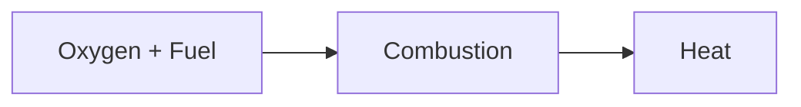

| Date                         | Tags               |
| ---------------------------- | ------------------ |
| Wednesday, 04 September 2024 | #Semester-5/Meteks |

# Thermodynamics
## Ellingham Diagram
Main uses of this diagram:
- Determine the reduced metallic oxide to metal
- Determine the partial pressure of oxygen
- Determine the ratio of carbon monoxide to carbon dioxide
![[Pasted image 20240904103225.png|300]]

The equation that is used in the ellingham diagram
![[Pasted image 20240904103334.png]]
$$\frac{2X}{Y} M_{(s)} + O_2(g) = \frac{2}{\gamma} M_X O_Y (s)$$ $$k=\lbrack \frac{(A_{M_xO_y})^{2/Y}}{{A_M}^{2X/Y}. a_{O_2}}\rbrack$$
## Smelting and Converting
Chalcopyrite ($Cu_2S.FeS$)
![[Pasted image 20240904105721.png|300]]
- Semakin ke bawah -> Gibs lebih negative -> spontan
- Ketika $FeS$ habis, dia berubah dari smelting menjadi **converting**
	- Tahapan Converting
		A. Remove Remaining $FeS$, ini nanti dia bakalan berubah dari ngebuat $FeS$ menjadi $Cu_2S$
		B. Removing S from $Cu_2S$, ketika dia mulai merubah si $Cu_2S$, dia akan berubah ke tembaga terlebih dahulu dibanding ke tembaga oksidasi

With computer visualization of copper smelting
![[Pasted image 20240904105855.png|300]]

## Thermodynamics Simulation
Based on the categories
A. Thermochemical properties
- [HSC Chemistry](https://archive.org/download/hsc-6.0)
- [FactSage](https://factsage.com/)
B. Mineral Process Simulation & Optimization
C. Process Simulation

# Pyrometallurgy
## Process: Preliminary, Smelting, Refining
- Preliminary: menghilangkan apa yang bisa dihilangkan di awal (yang tidak bermanfaat), contohnya air dan carbonat

### A. Reduksi Oksidasi
### B. Ekstraksi Sulfida
### C. Ekstraksi Halida

# Heat Generation - Sumber dan Pembangkit Panas
## Combustion of Carbonaceous Fuels

Caloric Value: heat generated by the combustion of fuel
Heat is transferred by:
- conduction: direct contact
- convection: fluid (water, air)
- radiation: no contact

## Generation of heat
### Gas
When combustin fuel and oxygen, there are a fraction that escapes combustion **(heat loss)** due to:
- The design of the reactor
- Kinetics of the reaction itself

Carbonaceous fuels state are solid, liquid, gaseous. Gaseous state is preffered because of:
- Easily stored
- Obtained free from sulfur
- No solid residue or ash

### Coal
Basic raw material which can be converted to a liquid fuel (coal liquefaction) by reaction with hydrogen under pressure or to a gaseous fuel (coal gasificiation) by reaction with air and water vapor.

# Reference
- Reference 1
- Reference 2
- Reference 3

