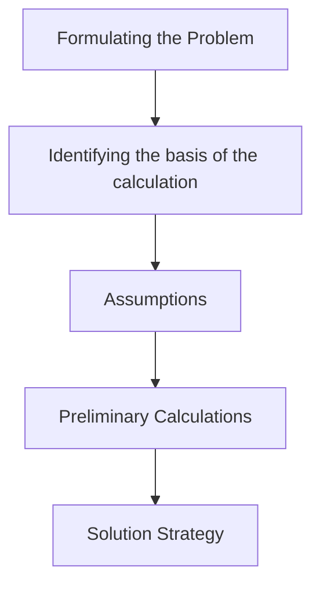

| Date                       | Tags               |
| -------------------------- | ------------------ |
| Wednesday, 02 October 2024 | #Semester-5/Meteks |

# Material Balances
is a form of book-keeping for a process which is already operating. The basic equation in material balances is the law of conservation of matter
![[Pasted image 20241002102146.png]]
- mi = raw material which enters
- mj = the mass of each product which leaves the process
- %x = weight percentage of element x in that raw material or product
- If the $m_x$ = 0, we say that steady state conditions exist

## Flow Sheet
The process or combination of processes which is used in a given plant is illustrated conveniently by means of a flow sheet. This flow sheet consists of combinations of steps or operations and that some of the same steps or operations are found in the production of different metals and in different lcoations.

## Persamaan Umum
- *Non Reaksi Kimiawi*
	- Input = Output + Akumulasi
	- 
- *Reaksi Kimia*
	- Input + Produksi = Konsumsi + Output + Akumulasi
		- Input: besaran campuran material
		- Produksi: senyawa yang terbentuk sebagai hasil reaksi
		- Konsumsi: reaktan yang bereaksi selama reaksi kimia
		- Akumulasi: Excess atau kelebihan senyawa
	- Basis perhitungan
		- Senyawa atau molekul
		- Unsur
## Unit Processes and Unit Operations
![[Pasted image 20241002103256.png]]
Sebuah sistem dari pemurnian (steel making process) disini dapat dilihat kalau sudah dibentuk dalam diagram alir.

*Subsistem yang melibatkan reaksi kimia*
- Melting Furnace
- Degassing Furnace
- Pump

*Subsistem yang tidak melibatkan reaksi kimia*
- Scrap Mixer
- Perhitungannya menggunakan stoichiometric

## Material Balance Under Steady State Conditions
$$\text{Raw Materials [A+B+C] = Products [L+M+N]}$$
Component
- x $\rightarrow$ mA (%x) + mB (%x) + mC (%x) = mL (%x) + mM (%x) +mN (%x)
- untuk komponen y sama z sama aja rumusnya, tetapi %x diganti dengan %y/%z

## Basic Flowsheet

## Contoh Soal
### Soal 1
![[Pasted image 20241002104139.png]]

(input) $m_A$ = 1000kg $\rightarrow$ (output) 1000 kg
$m_{Cd}$ $\rightarrow$ $w_ACd$ * $m_A$ = 0.5 * 1000kg =  500kg
$m_{Zn}$ $\rightarrow$ 1000kg - 500kg = 500kg

Gas Cd = 454 kg, maka Solid = 500-454 = 46kg
Solid Zn = 472kg, maka Gas = 500-472 = 28kg

## Soal 2
![[Pasted image 20241002104811.png]]
- Total $\rightarrow$ 26,600 = 100%
- Cu $\rightarrow$ 21,215 = 0.797%
- Zn $\rightarrow$ 5,385 = 0.203%

[[Atomic Species Mass Balance Example 3]]

# Reference
- Reference 1
- Reference 2
- Reference 3

