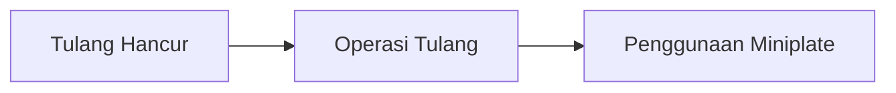

| Date                      | Tags                   |
| ------------------------- | ---------------------- |
| Wednesday, 28 August 2024 | #Semester-5/Prosmanlog |

---
# Introduction to Metal Manufacturing
In general, the techniques used to fabricates metals are such below:

## Forming Operations
### A. Extrusion
metal is squeezed into a cavity (die) using mechanical or hydraulical press. 
![[indirect extrusion.png|250]] 
![[direct extrusion.png|250]]

### B. Rolling 
![[sheet metal forming (rolling).png|300]]
### C. Pressing and Deep drawing
![[pressing and deep drawing.png|200]]

---
## Casting
Merupakan proses pembentukan logam (ferrous dan non ferrous) dengan cara memasukkan logam cair ke dalam cetakan berongga dan dilanjutkan dengan proses pembekuan (pendinginan) logam tersebut. 

| 
Casting Furnace
 ![[Casting furnace.png\|200]] | 
Die Casting
 ![[Die Casting.png\|242]] |
| ----------------------------------------------------------------- | --------------------------------------------------------- |
| <b>
Wax Casting
</b> ![[Wax casting.png\|200]]  |                                                           |

Peranan Casting
- Sebanyak 90% produk manufaktur terbuat dari komponen hasil metal casting
- Digunakan untuk machinery equipment, house hold, transportation, communication and electronic, etc.

Keuntungan Casting
- Dapat membuat produk dengan bentuk rumit dan berongga
- Tingkat presisi yang beragam (longgar hingga sangat ketat)
- Jumlah produk fleksibel (satuan ataupun masal)
- Proses pengerjaan dengan waktu dan biaya lebih minimum

Kelemahan Casting 
- Kekuatannya kurang karena terbentuk dendrit
- Cacat lubang halus (pin hole dan shrinkage)
- Diperlukan heat treatment untuk memperbaiki sifat mechanical
- Variabel untuk mendapatkan cor banyak (temp, comp, design, cast condition)

Cara memasukkan cairan logam
- gravity casting
- pressure die casting (low <20MPa dan high 20-80MPa)
- Centrifugal casting
- Vacum Casting (Ti dan Mg)

Bahan Casting
- Logam dengan titik lebur rendah
	Paduan: Zn, Pb, dan Al
	Dibakar menggunakan coal, oil, gas, electric
- Logam dengan titik lebur sedang
	Paduan: cast iron, tembaga
	Dibakar menggunakan cokes
- Logam dengan titik lebur tinggi
	Paduan: steel, alloy steel, nickel alloy, electric
	Dibakar dengan induction furnace
- Logam yang mudah teroksidasi
	Paduan: Titanium alloy
	Dibakar dengan electric furnace with vacuum

Cetakan Casting
Fungsi dari cetakan adalah untuk memberikan bentuk dan dimensi pada benda yang akan diproduksi. Untuk mendapatkan benda cor yang baik, dibutuhkan cetakan yang lebih baik lagi. Berikut ini jenis cetakan berdasarkan materialnya:
- 1. Cetakan pasir (sand mold)
	Penggunaan: sekali pakai karena cetakan melebar (expand)
	material: logam ferrous seperti cast iron dan alloy steel casting
	sifat: isolator dan pendinginan lambat (menghasilkan butir keras)
	
	Keuntungan: permeabilitas bagus karena udara dapat keluar dengan mudah
	Kekurangan: distribusi butir pasir harus sesuai agar permukaan halus
	
	Production: menggunakan bahan pengikat atau binder
		- Fisik: bentonit (clay)
		- Kimiawi: furan atau pep-set
		Pola dibuat menggunakan pola kayu atau stereform
		![[production steps in sand-casting.png|400]]
		
- 2. Keramik (investment)
	Penggunaan: sekali pakai karena cetakan melebar (expand)
	
	Keuntungan: bersifat isolator dan untuk benda yang rumit
	Kekurangan: relatif mahal dan tidak dapat direklamasi

	Production: 		![[metal casting production.png|400]]
	
- 3. Logam (dapat digunakan berulang)
	Proses: pressure die casting dan gravity casting
	Material: logam non ferrous (titik lebur rendah seperti paduan aluminium dan magnesium)
	
	Keuntungan: pendinginan cepat (menghasilkan struktur halus dan sifat mekanis tinggi)
	Kekurangan: mahal dan bersifat non isolator

	Production: harus menggunakan coating (agar permukaan cetakan tidak retak dan sebagai isolator agar tidak overheating)
	1. Preheat mold and spray coating
	2. Insert core and close mold
	3. Pour molten metal
	4. Finished part

Defects
![[Casting defect.png|400]]
Contoh kasus: Gravity Casting
Ketika cairan logam dimasukkan terlalu cepat ke mold, nanti akan terbentuk turbulence. Hal tersebut akan membuat udara terperangkap sehingga produk akhir akan berongga.
![[casting principle.png|300]]
Cara menghindari kecatatan
- Membuat desain casting yang baik
- Cara membuat cairan logam yang benar

---
## Miscellaneous
### A. Powder metallurgy
![[Powder Metallurgy.png|450]]

### B. Metal Injection Molding
![[Metal injection molding.png|450]]
Salah satu penggunaan miniplate adalah untuk operasi tulang.

![[miniplate in feet.png]]

# Reference
- PPT
