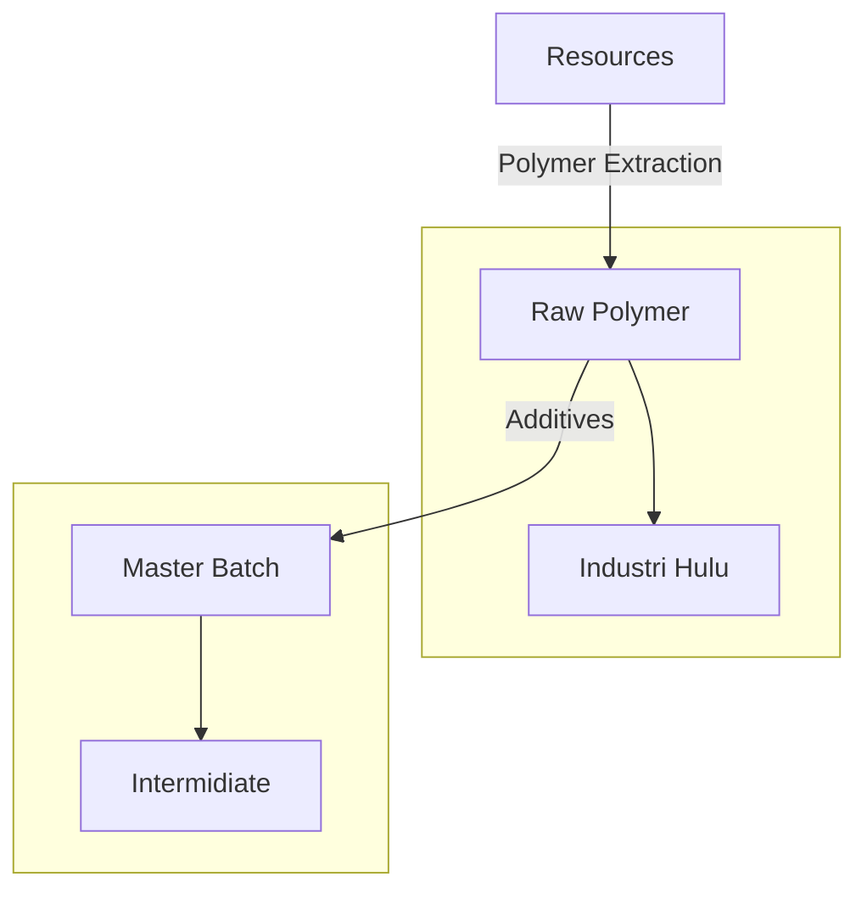

| Date                     | Tags               |
| ------------------------ | ------------------ |
| Thursday, 29 August 2024 | #Semester-5/Tekpol |

# Introduction
## Polymers Mineral Review
A. Polymer Classification
	Based on the its monomers building: 
	- Homopolymer: consists of identical monomers
	- Copolymer: consists of different monomers (alternating, random, block, branch)
	 
	Based on the its structure
	- Linear
	- Branched
	- Crosslinked
	- Network
	
	 Based from its origin
	 - Natural
	 - Synthetic
		 A. Petro
			 - Olefin
			 - Aromatic
		 B. Biobased
	

B. Pembuatan polymer

# Reference
- Reference 1
- Reference 2
- Reference 3

