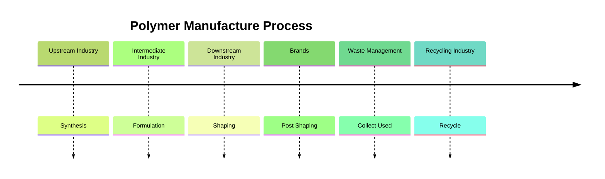

| Date     | Tags         |
| -------- | ------------ |
| Thursday, 31 October 2024 | #Semester-5/Tekpol |

# Introduction to Polymer Life Cycle
## Life Cycle of Polymer
![[biological and technical life cycle of polymer.png]]
1. **Resource Extraction or Synthesis**
Misalnya petroleum harus disintesis, contoh: PVC, PP, PE ,dll. Bisa juga yang natural, contohnya: kapas, kitosan, alginat, gelatin, protein.

2. **Manufacture**
Misalnya pelelehan (polimer in general), dipintal (kapas), dilarutkan (coating dan cat). Sehingga didapat produk yang bisa dijual ke konsumen.

3. **Waste**
Kalau misal bisa di-collect dan didaur ulang, dia tidak akan menjadi polution. Sehingga ada PBB membahas untuk penggunaan polimer, misalnya banning one time use plastic. Ada concern, kalau di ban single use, nanti ke bio polymer, tapi belum tentu dia yang bisa terurai di alam tuh baik. Jadi ini diskusinya tentang chemical content.

**Waste Management**
- Negara berkembang: ada pemulung (untuk collection)
- Negara maju: tidak ada pemulung. Misal di jepang tuh recycling rate di angka 95%. Baik itu yang *primer* (dari pabrik ke pabrik, ini pre-consumer dan closed loop recycling), *sekunder* (dari post consumer jadi produk lain), atau *chemically recycling* seperti di Tokyo (sampah campur aduk gak jelas, misal multilayer plastic $\rightarrow$ dijadiin gas amonia, nitrogen, dan CO2 dalam bentuk dry ice, liquid, atau gas). Energi dipakai buat panasin air, karena mereka menggunakan banyak bath house.

- ![[polystyrene recycling]]
	- Untuk daur ulang bagi sterofoam atau yang kontak dengan makanan, dia nanti bakalan dilayer dengan polymer yang fresh jadi dia bisa menjadi food grade atau safe buat makanan.

4. Engineering Process
Setiap di recycling pasti sifatnya berkurang karena ada degradasi, jadi nanti bakalan ditambahin sama aditif biar sifatnya itu masih terjaga.

**Sebutan pada Daur Ulang Polimer**
Menghasilkan produk yang sama $\rightarrow$ closed loop cycle
Menghasilkan produk yang berbeda $\rightarrow$ open loop cycle

## Polymer Manufacture

Diawali dengan synthesis dan extraction, ini pembentukan dari monomer menjadi polimer. Industri ini disebut dengan **upstream industry** atau industri hulu, contoh chandra asri, pertamina, lotte chemical, ineos, polytama, trinseo. Kemudian ada **intermediate industry** (formulation), mereka membuat raw materials buat manufaktur nantinya, jadi permintaan spesifik dari hilir, contoh: rehau, clariant, inter aneka, polychem. Berikutnya ada downstream industry ini nanti, mereka yang melakukan **shaping**. Untuk brands itu nanti mereka melakukan **post shaping** dan setelah nanti dipakai, maka akan dikumpulkan oleh **waste management** yang nanti akan didaur ulang oleh **recycling industry**.